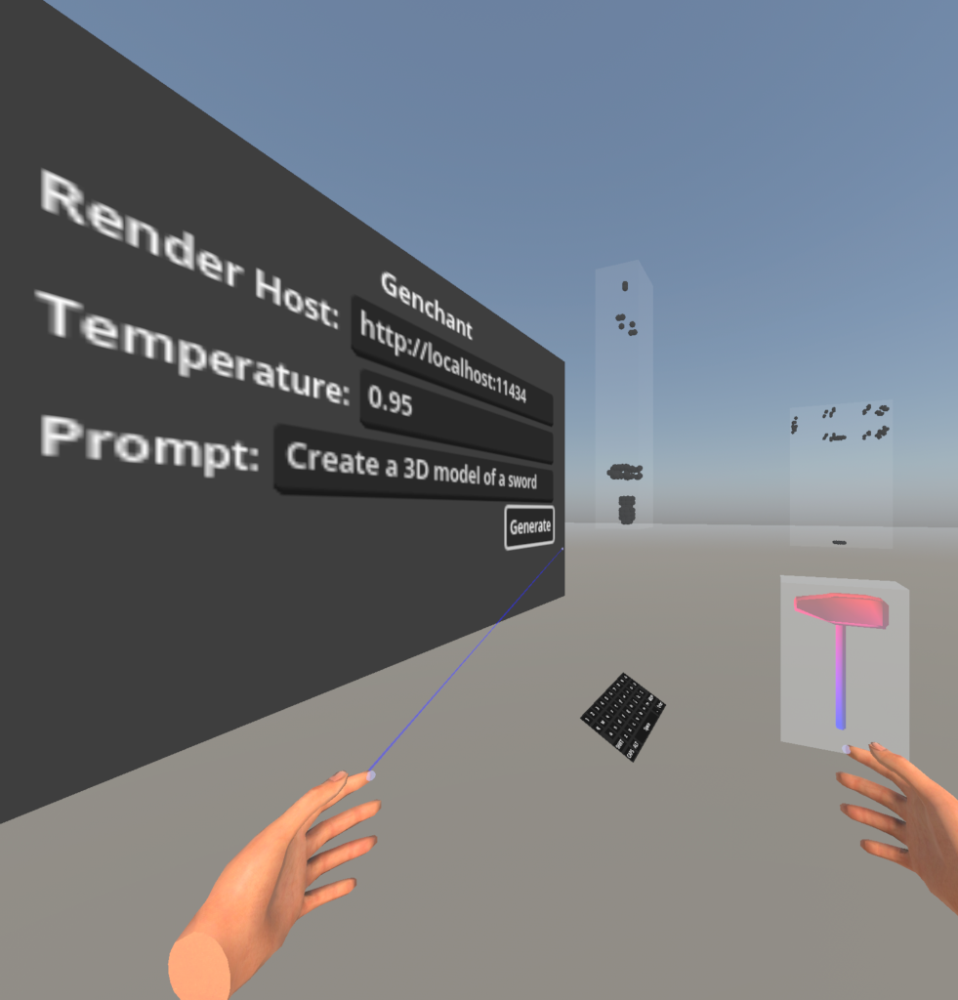

# genchanted

Put on your robe and wizard hat!

<div style="text-align:center;">
  
</div>

"Genchanted" was created for the [Godot XR Game Jam (Feb 2025)](https://itch.io/jam/godot-xr-game-jam-feb-2025) with the theme "Enchanted!" as a proof-of-concept tool for using AI to generate 3D objects directly into Godot, as if by magic.

[](https://www.youtube.com/watch?v=bzf0OC3e_ww)
Demonstration video

<div style="text-align:center;">
  
</div>
Generating a sword in XR Simulator

## Features
- Render 3D objects from a text prompt using Generative AI
- Generated objects are imported directly into Godot during gameplay
- Vertexes are previewed in realtime as they are generated
- Rendering can be on same system (such as for PCVR) or a remote server (such as for Meta Quest)
- Forked from [styx-godot](https://github.com/Jigsaw-Studio/styx-godot) 3D network traffic and data visualization application
- Supports [Ollama](https://ollama.com/) or [generate-glb](https://github.com/castellotti/generate-glb) backends for 3D object generation
- "Teleport" locomotion for AR/VR/XR environments
- On-screen Joystick Touch Pad support for mobile and tablet devices
- Released as Open Source under the permissive MIT License

## Platforms
- Apple Vision Pro
- Meta Quest 3, 3s, and 2
- SteamVR and OpenXR headsets (such as Valve Index)
- WebXR supported devices
- Android
- iPhone and iPad

## Instructions

### Setup
- Download and install for your preferred platform
- Configure `Network Rendering` according to `Dependencies` below
- Launch Genchanted
- Verify the `Render Host` URL matches your network rendering server (default is localhost for PCVR)
- Adjust the `Temperature` as desired, the higher the value the more "creative" the model
- Adjust the prompt to your preferred object. Note that a single word works best
- Click "Generate" (or the large circular button for touchscreen interfaces) to request 3D object generation from the network host

### Tips
- It may take several seconds for generation to begin, vertexes will be rendered as black dots inside a translucent cube as they are streamed from the host
- Examples of previously-rendered objects (a sword and a hammer) as displayed to illustrate expected output
- Generating objects which were in the model's original training data will work best, though not all types of model names are known. Here's some examples:
  - `sword`
  - `hammer`
  - `ring`
  - `barrel`
  - `lamp`
- **Note**: There are several quantized versions of the [LLaMA-Mesh](https://github.com/nv-tlabs/LLaMA-Mesh) available on HuggingFace, but the original non-quantized version seems to work the best. It will be necessary to use [generate-glb](https://github.com/castellotti/generate-glb) (written specifically for this project) to host network access to that model.

## Dependencies

### Network Rendering

#### Ollama
**Note**: Easiest setup
- [Download](https://ollama.com/download) and install Ollama
- Install a supported [model](https://huggingface.co/bartowski/LLaMA-Mesh-GGUF), for example:
```shell
ollama pull hf.co/bartowski/LLaMA-Mesh-GGUF:Q4_K_M
```
- For Windows network host (Windows serving to other devices over a network), close Ollama and re-launch using a batch file named `ollama-server.bat`:
```shell
@echo off
set OLLAMA_HOST=0.0.0.0:11434
ollama serve
```

#### generate-glb
**Note**: Best results
- Install `generate-glb` by following the [instructions found in the repository](https://github.com/castellotti/generate-glb?tab=readme-ov-file#instructions)
- Launch the server on the network interface:
```shell
python3 src/server.py --host 0.0.0.0 --port 11434
```

#### Docker with CUDA (NVIDIA Container Toolkit)
**Note**: Best results, fastest
- Recommended: NVIDIA card with 16 GB+ of VRAM (3090, 4080, 4090, 5080, 5090, etc.)
- If [NVIDIA Container Toolkit](https://docs.nvidia.com/datacenter/cloud-native/container-toolkit/latest/install-guide.html) with [CUDA](https://developer.nvidia.com/cuda-downloads?target_os=Linux&target_arch=x86_64&Distribution=Ubuntu&target_version=24.04&target_type=deb_local) support is available on the system:
```shell
docker run \
  --gpus all \
  -p 11434:11434   \
  -v ${PWD}/logs:/logs \
  -v ${HOME}/.cache/huggingface:/root/.cache/huggingface   \
  ghcr.io/castellotti/generate-glb/generate-glb:main-cuda   \
  python3 /app/src/server.py \
    --host 0.0.0.0 \
    --port 11434
```

## Source Code Dependencies

### Apple Vision Pro
- Reference: [GodotVision](https://godot.vision/)
- Requires updates from Godot 4.2 to 4.3
- Download Godot 4.3 version of modules:
    ```
    git clone git@github.com:kevinw/GodotVision.git
    git clone git@github.com:multijam/SwiftGodot.git
    git clone git@github.com:multijam/SwiftGodotKit.git
    ```
- Download Godot 4.3 version of [libgodot.xcframework.zip](https://github.com/multijam/SwiftGodot/releases/download/4.3.0/libgodot.xcframework.zip)
- Extract `libgodot.xcframework` and place into `SwiftGodot` root directory from git repository (this prevents a later error during import that local binary targets `libgodot_tests` and `binary_libgodot` at the `SwiftGodot/libgodot.xcframework` location "does not contain a binary artifact.")
- Open `GodotProject/project.godot` once in Godot 4.3 editor to automatically import assets
- Open `Styx.xcodeproj` Xcode project in Xcode 16.2
- Build and Run on visionOS simulator or install to Apple Vision Pro (will require adding App Store Team ID)

### Meta Quest and Android devices
- Follow the standard Godot [Deploying to Android](https://docs.godotengine.org/en/stable/tutorials/xr/deploying_to_android.html) guide

### WebXR
- Reference: Godot [Exporting for the Web](https://docs.godotengine.org/en/stable/tutorials/export/exporting_for_web.html) guide
- Generate a Web Export to a build directory with name `index.html`
- Transfer all files from build directory to [styx-os](https://github.com/Jigsaw-Studio/styx-os) at path `/srv/styx-web/html`
- Example all-in-one command on macOS:
    ```
    /Applications/Godot\ 4.3.app/Contents/MacOS/Godot \
  	  --path $HOME/genchanted/Godot_Project \
  	  --headless \
  	  --export-release "Web" \
            $HOME/genchanted/Godot_Project/build/html/index.html \
    && rsync --delete -zvaP \
        $HOME/genchanted/Godot_Project/build/html/* \
        172.16.100.1:/srv/styx-web/html
    ```

### iOS and iPadOS
- Reference: Godot [Exporting for iOS](https://docs.godotengine.org/en/stable/tutorials/export/exporting_for_ios.html) guide
- In most cases the default settings for exporting to iOS should be sufficient

## Credits
- Models: [LLaMA-Mesh](https://github.com/nv-tlabs/LLaMA-Mesh) and [meshgen](https://github.com/huggingface/meshgen)
- Godot XR Tools: [Website](https://godotvr.github.io/godot-xr-tools/), [GitHub](https://github.com/GodotVR/godot-xr-tools) (special thanks [Bastiaan Olij](https://github.com/BastiaanOlij))
- [GodotVision](https://godot.vision/) (special thanks [Kevin Watters](https://github.com/kevinw))
- [Pocket Godot](https://github.com/lukky-nl/Pocket-Godot) (special thanks [@lukky-nl](https://github.com/lukky-nl))
- David Snopek's [How to make a VR game for WebXR with Godot 4](https://www.snopekgames.com/tutorial/2023/how-make-vr-game-webxr-godot-4)
